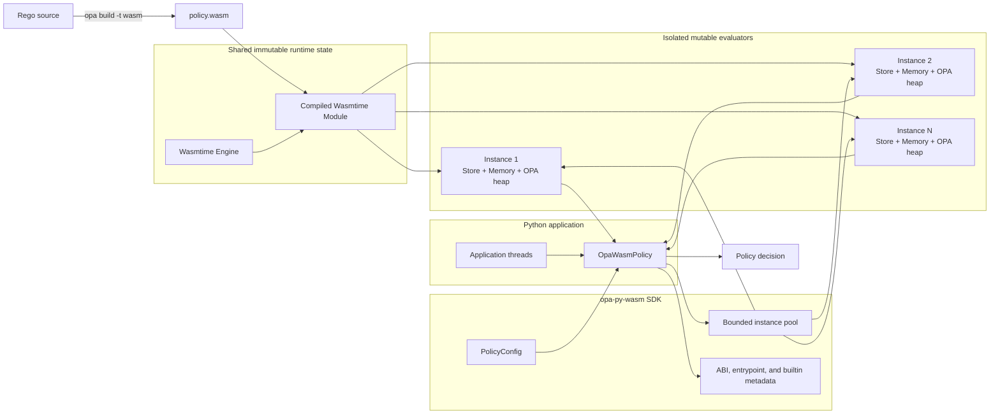
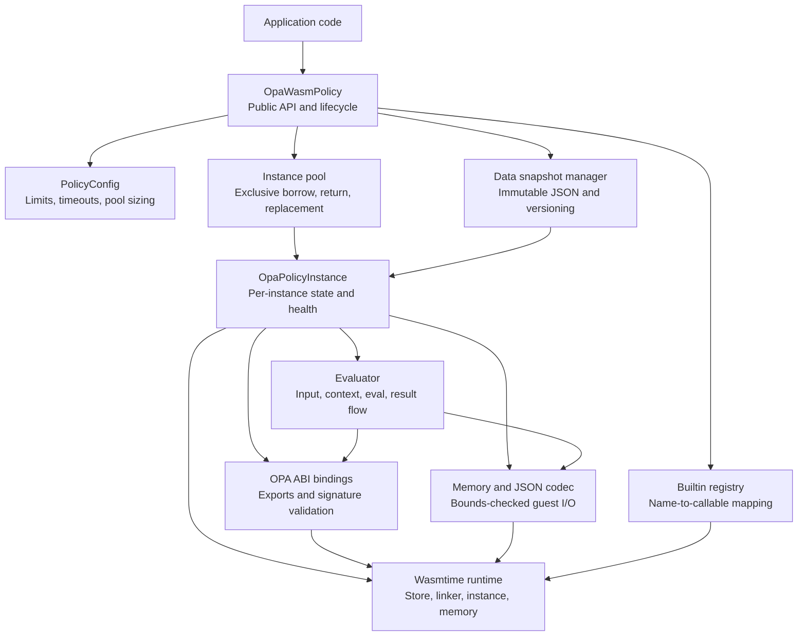
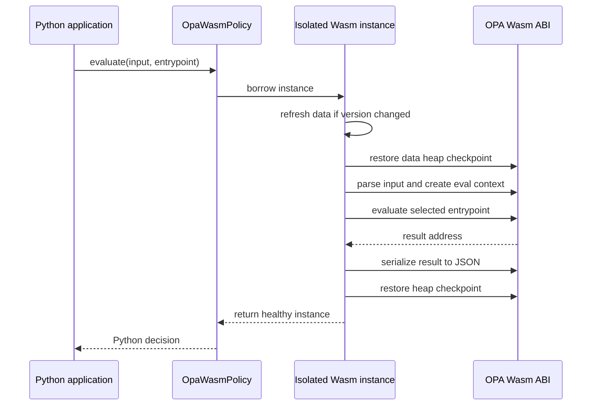
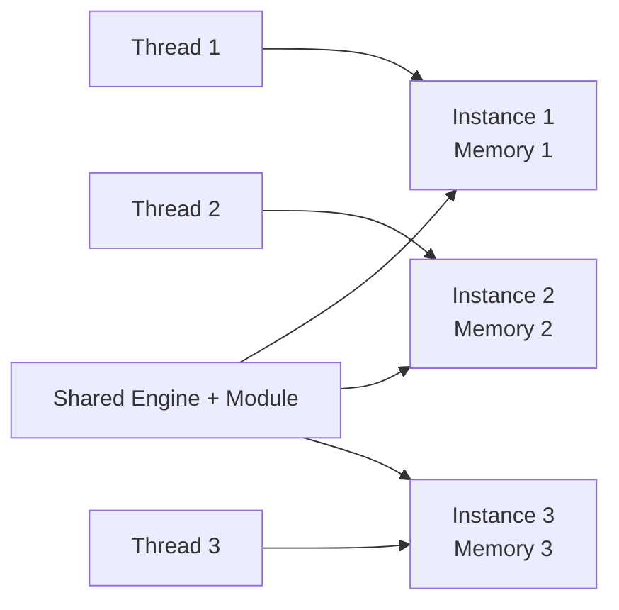
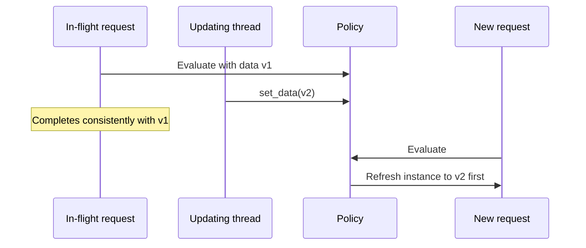
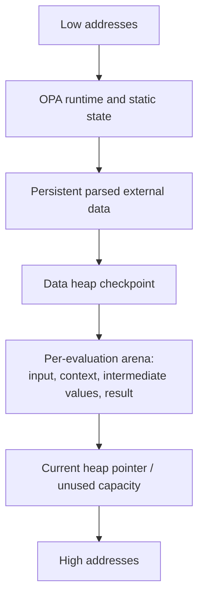
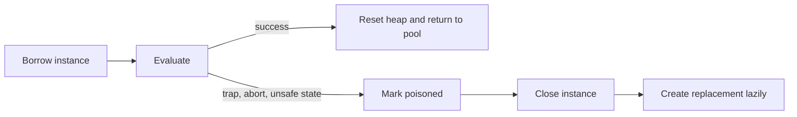

# User guide

`opa-py-wasm` is an in-process Python SDK for evaluating Open Policy Agent (OPA)
policies compiled to WebAssembly. It uses Wasmtime and does not require an OPA
server, subprocess, or network call at runtime.

Use it for low-latency authorization, validation, and policy decisions inside
Python services.

> **Python import:** `opapywasm`

This is the end-to-end guide. For focused references see
[`api.md`](api.md), [`architecture.md`](architecture.md),
[`thread_safety.md`](thread_safety.md), [`opa_abi.md`](opa_abi.md), and
[`capacity_planning.md`](capacity_planning.md).

---

## How it works

OPA compiles Rego into `policy.wasm`. The SDK loads and validates the module,
then evaluates requests through a bounded pool of isolated Wasmtime instances.

### Architecture



### SDK components



| Component | Responsibility |
|---|---|
| `OpaWasmPolicy` | Thread-safe public facade, configuration, data updates, builtin registration, and shutdown |
| Instance pool | Bounds concurrency and gives each active evaluation exclusive ownership of one instance |
| Policy instance | Owns one Store, Wasm instance, linear memory, heap checkpoints, data version, and poison state |
| Runtime/ABI layer | Instantiates Wasmtime, links host imports, validates OPA exports, and invokes ABI functions |
| Evaluator | Runs the request lifecycle and restores the instance to a reusable state |
| Memory/JSON codec | Performs UTF-8 conversion, size enforcement, pointer validation, and bounded memory reads/writes |
| Data manager | Stores immutable serialized data and coordinates lazy version refresh across pooled instances |
| Builtin registry | Resolves policy-required builtin names to thread-safe Python implementations |

The compiled module is shared. Each concurrent evaluator has its own:

- Wasmtime `Store`, `Instance`, and linear memory;
- OPA heap and allocator state;
- parsed external data;
- input, evaluation scratch space, and result memory.

This isolation is what makes the public policy object thread-safe.

---

## Installation

```shell
pip install opa-py-wasm
```

Or with [uv](https://docs.astral.sh/uv/):

```shell
uv add opa-py-wasm
```

For YAML builtins (`yaml.is_valid`, `yaml.marshal`, `yaml.unmarshal`):

```shell
uv add "opa-py-wasm[yaml]"
```

Requires Python 3.10 or newer. The only runtime dependency is
[`wasmtime`](https://pypi.org/project/wasmtime/), which pip resolves
automatically.

---

## Compile a Rego policy

The SDK consumes a precompiled Wasm module and does not compile Rego at runtime.

```rego
package authz

default allow := false

allow if {
    input.user == "alice"
    data.roles[input.user] == "admin"
}
```

```shell
opa build -t wasm -e authz/allow policy.rego
```

Extract `policy.wasm` from the generated bundle and package it with the
application or distribute it through your artifact pipeline.

Record the policy version, source commit, OPA compiler version, SHA-256 digest,
compiled entrypoints, and required host builtins with each artifact.

---

## Quick start

```python
from opapywasm import UNDEFINED, OpaWasmPolicy, PolicyConfig

config = PolicyConfig(
    pool_size=8,
    default_entrypoint="authz/allow",
    borrow_timeout_seconds=2.0,
    eval_timeout_seconds=1.0,
    max_memory_pages=256,
    max_input_bytes=1_000_000,
    max_data_bytes=10_000_000,
    max_result_bytes=1_000_000,
)

with OpaWasmPolicy.from_wasm_file("policy.wasm", config=config) as policy:
    policy.set_data({
        "roles": {
            "alice": "admin",
            "bob": "viewer",
        }
    })

    decision = policy.evaluate({"user": "alice"})

    if decision is UNDEFINED:
        print("No policy decision")
    elif decision is True:
        print("Allowed")
    else:
        print("Denied")
```

Create the policy once and reuse it. Do not create a new `OpaWasmPolicy` for
every request.

### Evaluation flow



---

## Result semantics

`evaluate()` returns the value under the first OPA result object's `result`
field.

| OPA result | Python result |
|---|---|
| `[]` | `UNDEFINED` |
| `[{"result": true}]` | `True` |
| `[{"result": false}]` | `False` |
| `[{"result": null}]` | `None` |
| `[{"result": {...}}]` | `dict` |
| `[{"result": [...]}]` | `list` |

Undefined and JSON `null` are intentionally different:

```python
if result is UNDEFINED:
    # The policy produced no result.
    ...
elif result is None:
    # The policy explicitly returned null.
    ...
```

Use `evaluate_raw()` when the complete OPA result set is required.

Keep `strict_result_shape=True` unless the application intentionally consumes a
different result structure.

---

## Configuration

Important `PolicyConfig` settings:

| Setting | Purpose |
|---|---|
| `pool_size` | Maximum pooled instances and simultaneous evaluations |
| `default_entrypoint` | Entrypoint used when none is supplied per call |
| `borrow_timeout_seconds` | Maximum wait for a free instance |
| `eval_timeout_seconds` | Wasm evaluation deadline |
| `max_memory_pages` | Per-instance linear-memory limit; one page is 64 KiB |
| `max_input_bytes` | Maximum serialized input size |
| `max_data_bytes` | Maximum serialized external-data size |
| `max_result_bytes` | Maximum result size |
| `strict_result` | Raise instead of returning `UNDEFINED` |
| `strict_result_shape` | Reject unexpected non-empty result structures |

Start with conservative limits and tune them using representative policies,
data, and production traffic. See [`api.md`](api.md) for every field and its
default, and [`capacity_planning.md`](capacity_planning.md) for sizing
methodology.

---

## Threading and concurrency

`OpaWasmPolicy` is thread-safe. An individual policy instance is not shared
concurrently.



Concurrency rules:

- Call `evaluate()` concurrently on the same `OpaWasmPolicy`.
- Actual simultaneous evaluations are bounded by `pool_size`.
- Additional callers wait until `borrow_timeout_seconds` expires.
- Wasm instances are isolated, preventing cross-request memory corruption.
- Custom Python builtins may run concurrently and must be thread-safe.
- Guest Wasm may execute in parallel, but Python builtin work remains subject to
  Python runtime and GIL behavior.

Start with a pool size near the CPU cores available to the process, then
benchmark. Larger pools increase memory use and do not automatically improve
throughput.

---

## External data updates

```python
policy.set_data({"roles": {"alice": "admin"}})
```

The SDK serializes the supplied value immediately and stores an immutable JSON
snapshot. Later mutation of the original Python object does not change policy
data.

Pooled instances reload a new data version lazily when next borrowed:



This means:

- an in-flight request may finish with the previous snapshot;
- requests starting after `set_data()` completes use the new version;
- data pointers are never shared across Wasm instances;
- a failed refresh causes the affected instance to be discarded.

---

## Memory behavior

Each pooled instance has independent Wasm linear memory.



For each evaluation, the SDK:

1. restores the heap to the data checkpoint;
2. writes the input;
3. executes the policy;
4. reads the result;
5. restores the checkpoint in a `finally` block.

Per-request allocations are reclaimed together using arena-style heap rollback.

Important operational behavior:

- logical OPA allocations are reclaimed after evaluation;
- Wasm memory pages can grow to a high-water mark and generally do not shrink;
- stable pages after a large request are not by themselves a leak;
- continually increasing pages or process memory under a stable workload
  requires investigation;
- `max_memory_pages` applies per pooled instance.

Approximate maximum guest linear memory:

```text
pool_size × max_memory_pages × 64 KiB
```

This excludes Python objects, Wasmtime/JIT metadata, stacks, and other process
memory.

An instance that traps or becomes unsafe is poisoned, closed, and replaced
rather than returned to the pool.



---

## Entrypoints

Entrypoints are selected when compiling the policy.

```python
print(policy.entrypoints)
# {'authz/allow': 0, 'authz/reasons': 1}
```

Use a configured default or select one per call:

```python
policy.evaluate(input_document, entrypoint="authz/reasons")
```

Do not assume entrypoint ID `0` is always the desired decision.

---

## Host builtins

Some Rego builtins require a Python host implementation.

```python
def tenant_status(tenant_id: str) -> dict:
    return {"tenant_id": tenant_id, "active": True}

policy.register_builtin("company.tenant_status", tenant_status)
```

Custom builtins must:

- be thread-safe;
- accept and return JSON-compatible values;
- avoid unbounded CPU, blocking calls, and mutable unsynchronized globals;
- enforce their own network or downstream timeouts;
- avoid retaining Wasm pointers or memory views;
- avoid exposing sensitive information in exceptions or logs.

The Wasmtime evaluation deadline cannot safely interrupt arbitrary Python code.
A blocked custom builtin can therefore exceed `eval_timeout_seconds`.

---

## Error handling

Handle errors by category rather than retrying every failure.

Typical categories include:

- invalid input or result shape;
- unknown entrypoint;
- unsupported or failed builtin;
- pool acquisition timeout;
- evaluation timeout or resource limit;
- incompatible or malformed Wasm module;
- guest trap or OPA abort;
- use after policy shutdown.

General retry guidance:

- application input errors: do not retry unchanged;
- unknown entrypoints or missing builtins: configuration/deployment issue;
- pool timeout: retry only when bounded by the request deadline;
- transient builtin dependency failure: follow the dependency's retry policy;
- evaluation trap: the SDK discards the instance, but repeated failures usually
  indicate a policy or input problem.

Every failure path raises a specific type from the `OpaWasmError` hierarchy;
see [`api.md`](api.md) for the full list.

---

## Lifecycle

Use the policy as a context manager or close it explicitly:

```python
with OpaWasmPolicy.from_wasm_file("policy.wasm", config=config) as policy:
    ...
```

During shutdown:

- reject new evaluations;
- allow in-flight evaluations to complete where the application permits;
- close the policy before process termination;
- avoid replacing the policy object while callers can still use the old one.

---

## Production adoption checklist

Before adoption, validate:

- policy results match native `opa eval` for representative inputs;
- all required entrypoints and host builtins are available;
- undefined, `false`, `null`, and empty results are handled distinctly;
- pool size and borrow timeout meet expected concurrency;
- input, data, result, memory, and evaluation limits are appropriate;
- custom builtins are thread-safe and enforce downstream timeouts;
- concurrency tests show no cross-request state leakage;
- repeated-evaluation tests show stable heap pointers and Wasm page counts;
- process RSS reaches a stable plateau under a representative soak test;
- malformed input, timeouts, traps, builtin failures, and shutdown are tested;
- policy artifacts are versioned, hashed, and rollback-ready;
- relevant metrics and logs include policy version and entrypoint, but not
  sensitive input by default.

---

## Troubleshooting

### Pool timeout

Likely causes:

- pool too small;
- long-running policy evaluations;
- slow custom builtins;
- traffic spikes.

Measure pool wait time and evaluation duration before increasing `pool_size`.

### Evaluation timeout

Check for expensive policy paths, unexpectedly large inputs/data, or slow Python
builtins. Builtins require their own timeout controls.

### Memory remains high after a large request

Wasm pages normally do not shrink. Confirm that page count and process RSS
stabilize rather than increasing indefinitely.

### Undefined decision

Confirm the correct entrypoint was compiled and selected, and that the
input/data satisfy at least one rule path. Undefined is not the same as `false`.

### Missing builtin

Inspect `policy.builtins`, register the required implementation before traffic
begins, and ensure every pooled instance can access a thread-safe callable.

---

## Compatibility and limitations

- Policies must be compiled to OPA Wasm before runtime.
- Only compiled entrypoints are available.
- Host-dependent builtins require Python implementations.
- `evaluate()` returns the first decision value; use `evaluate_raw()` for the
  complete OPA result set.
- Evaluation limits apply to guest Wasm, not arbitrary blocking Python builtin
  code.
- Wasm memory pages may remain at their high-water mark.
- Thread-safe evaluation does not guarantee linear throughput scaling; benchmark
  with representative policies and builtins.
